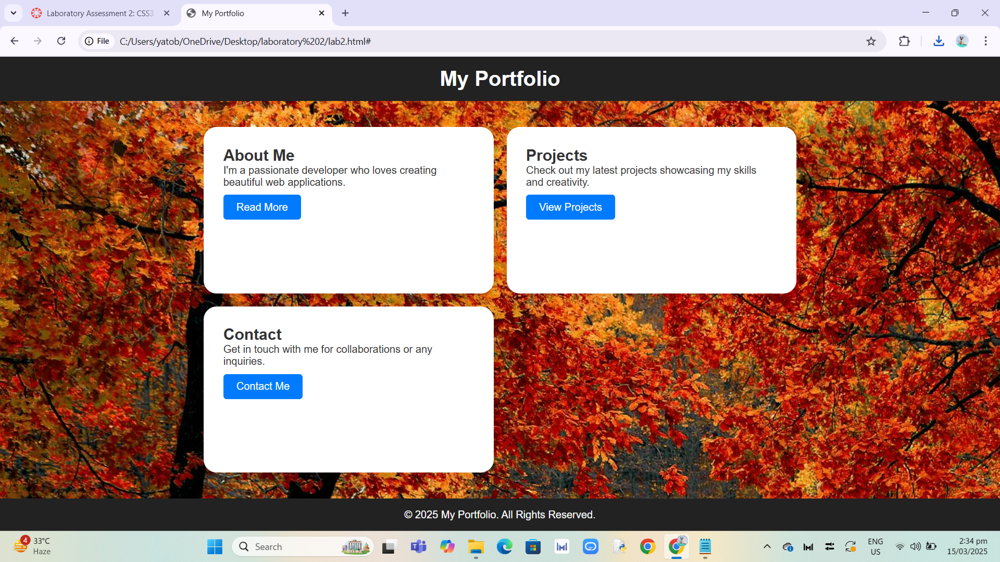
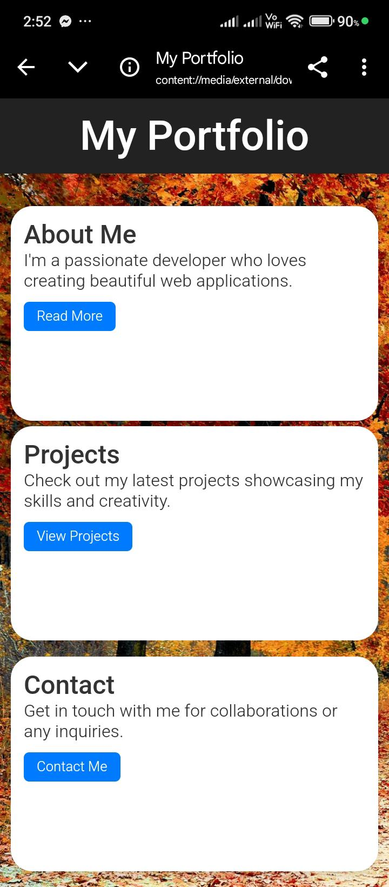

# Laboratory 2

This is a simple and responsive portfolio website built using HTML and CSS. The layout is designed using **Flexbox** and **CSS Grid** for a modern and structured appearance.

## Features:
- Fully responsive design using **media queries**.
- Uses **CSS Grid** for the layout and **Flexbox** for better content alignment.
- Includes a background image.
- Hosted on GitHub Pages / Vercel.

## Layout Approach:
- **CSS Grid** is used in the `.container` to organize the sections.
- **Flexbox** is used for centering content and structuring the header/footer.

## Responsive Design:
- The design adapts to different screen sizes using `@media` queries.
- Mobile screens (max-width: 600px) have adjusted font sizes for readability.

## Screenshot:
### Desktop View:

### Mobile View:

## Cross-Browser Compatibility:
Tested on:
- ✅ Chrome
- ✅ Edge

## Deployment:
The site is hosted at: [Live Demo](https://cyrylretuta.github.io/laboratory-2/)
